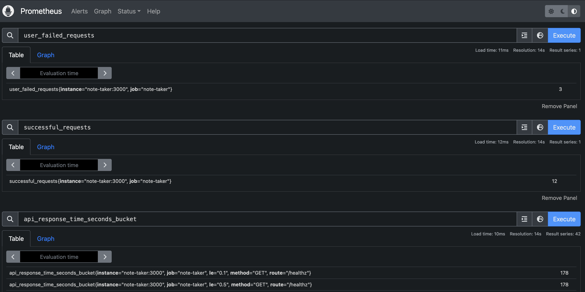
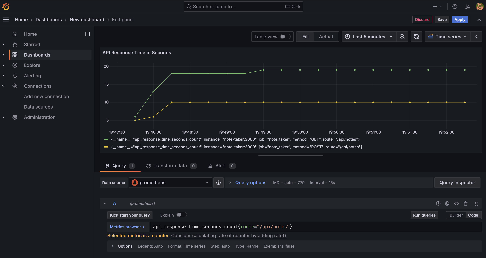

# Note Taker
A note taking app for managing notes.

## Setting Up Your Note Taker
### Prerequisites

This guide assumes you already have minikube installed on your local machine. 
If you do not, please follow the guides below to install it:
- Minikube Setup & Install: https://minikube.sigs.k8s.io/docs/start/

## Deploying the Note Taker to Kubernetes:
- Once your kubernetes environment is ready, you can deploy the application and other services required to run it.
- There is a Makefile which contains a `make deploy-note-taker` command.
    - Use this command to deploy the application and all required resources.
- After the command finishes, your resources should be available in the `sre-challenge` namespace.
- To connect to the Note Taker and Prometheus and Grafana monitoring tools when running in minikube on your local machine, you will need to run the following `make` command:
    - `make start-services`
    - This will allow you to access all of them via browser:
        - Note Taker - localhost:3000
        - Prometheus - localhost:9090
        - Grafana - localhost:3001
    Note: When adding Prometheus as a data source in Grafana, you should add the URL as:
        - http://prometheus:9090

## Directory Structure
```
─note-taker
├── Makefile # commands for deploying application in kubernetes
├── README.md
├── app # app files, operate here to deploy and test locally
│   ├── Dockerfile
│   ├── README.md # readme for application files
│   ├── MAkefile # commands for deploying application locally for development/testing
│   ├── app.js
│   ├── app.log
│   ├── metrics.log
│   ├── monitoring
│   │   └── prometheus-config.yml
│   ├── package-lock.json
│   ├── package.json
│   ├── scripts
│   │   └── deploy.sh
│   ├── tree.md
│   └── views
│       └── note.ejs
└── kubernetes # app files, allows app to be deployed and operated in kubernetes
    ├── note-taker
    │   ├── deployment.yaml
    │   └── service.yaml
    ├── prometheus
    │   ├── deployment.yaml
    │   ├── prometheus-config.yaml
    │   └── service.yaml
    └── redis
        ├── deployment.yaml
        └── service.yaml
```

## Challenges and Future Improvements:
#### Challenges:
- The biggest challenge I faced during the creation of this app was around creating the node.js application:
    - Because I haven't written a node.js app before, I needed to familiarize myself with what was expected and read through a few guides on setting up a server to build the application. 
    - It wasn't difficult to get started once I understood to basics though.

#### Decisions:
I had to decide on which scaling approach would be best for this application. There were two options I considered.
- KEDA (Kubernetes Event-Driven Autoscaling) - KEDA is great for autoscaling based on more complex parameters like queue lengths, database events, customized metrics, etc. And while I did consider it, I found it would be more complex than necessary for this challenge. It's great for production environments though.
- Kubernetes built-in Horizontal Pod Autoscaler (HPA) - Kubernetes provides this feature out of the box and it can handle autoscaling based on CPU or memory utilization. I ended up going with this one because of its simplicity and fit for this solution.

### Future Improvements:
#### Version Pinning Images:
- Right now, the images for each deployment in kubernetes are tagged with `latest`. 
    - This means that we will always use the most current release and while it would be nice to have the latest features, it also means we'll be inadvertent bug and vulnerability testers. Additionally, our code may not always work with the latest release.
    - We should implement version pinning and run with a version 1-3 releases behind the latest release to ensure we do not encounter app breaking changes, version incompatibility, and vulnerability exploits that might be found in a `latest` release.\

#### Tests for the application. These include but are not limited to:
- Unit Tests
    -  Testing individual pieces of our code. Specifically, testing our controller functions, error handling, and datastore interactions.
- Integration & End to End Testing
    - Testing the different parts of the app as a whole. Specifically, testing the API interactions end to end. Test our entire response cycle including adding, editing, deleting notes. Validate that metrics are being logged correctly across all existing routes. etc.
- Performance Tuning/Testing
    - Load testing with JMeter of Locust. Simulate a heavy load and see how the application performs. Will allow us to further examine our scaling strategy.

#### Removing /healthz from collected metrics in Prometheus
- This data is more important for our health checks in Kubernetes. We don't need to monitor on it in Prometheus so add a scrape config which drops these endpoints would be beneficial in future.

#### Rate Limiting:
- When API is exposed to the internet, it needs to be able to safely handle traffic and be protected against potential DDoS attacks.

#### Automation for Continuous Integration and Deployment
- Deploying via Makefile with kubernetes commands is rather simple, the goal would be to automate this with CI/CD. 
- In the end, we'd have a pipeline which is triggered by a push to the repo where this is stored which would deploy our application to the cluster.
    - We can accomplish this with Github actions, CircleCI, Jenkins, GitLab, etc.
    - We could also build our own wrapper for k8s to deploy manifests or use a tool like Helm to manage our application manifests.

#### Persistent Volumes and PVCs for Grafana and Prometheus
- Because we'd like to always have our visualizations available in Grafana and Prometheus even after a pod exits unexpectedly or needs to be updated, we should attach a persistent volume to them to preserve the data there.

## Logging and Monitoring:
- chaoskube Introduction:
    - After deploying chaoskube to my cluster and testing pod deletion at 1 minute intervals, the application had issues when there was only a single pod running as it could not recover fast enough for a user to not have their session disrupted.
    - Running 2 replicas solved the issue quickly as even when one was killed the other continued running, allowing a third pod to come up while the other pod was being terminated and for the end user to continue their session with minimal interruption.
- Metrics in Prometheus:
    - Here is an example of what the custom metrics for requests look like in Prometheus.
    
- Logging in Grafana:
    - I setup Grafana to visualize the custom metrics I recorded with Prometheus. Below is a view of a dashboard created with this feature:
    

## Author
Oli Blaine [(contact)](mailto:oliblaine@gmail.com)

## License
Project is licensed under the MIT License.
